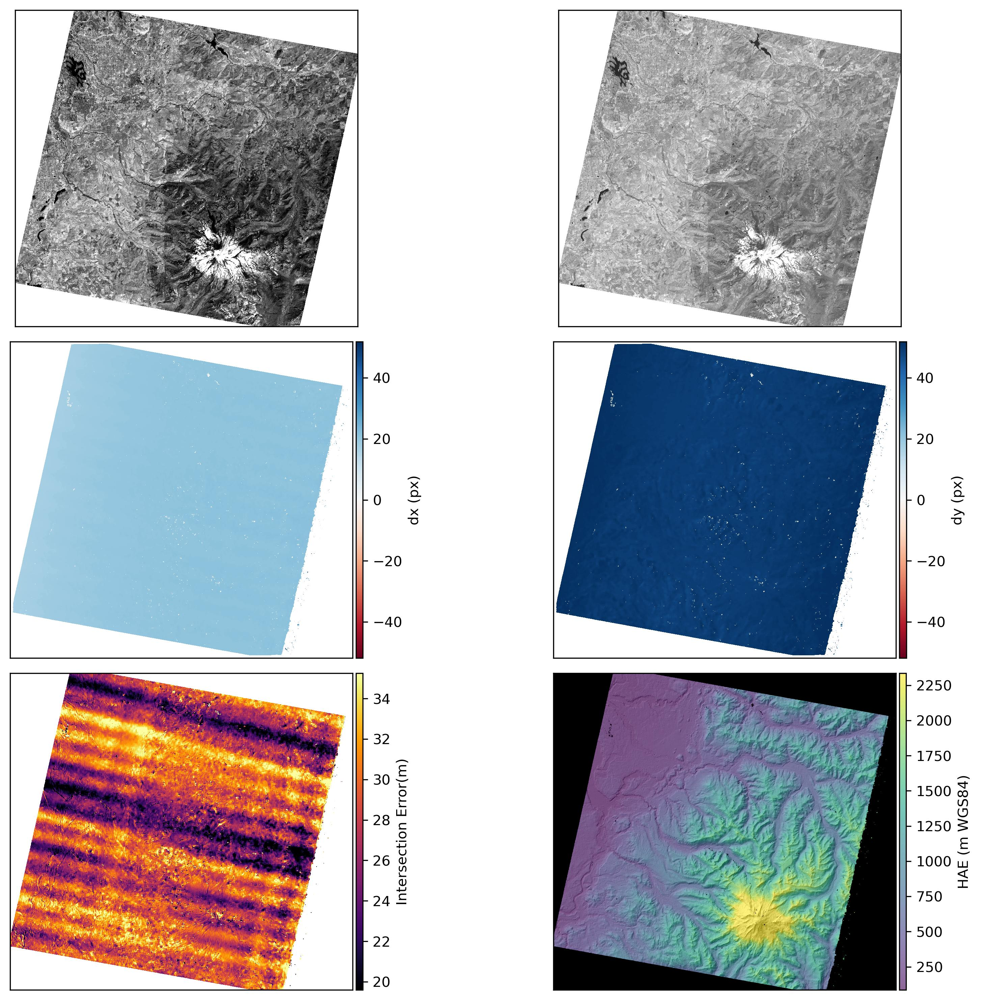

# asp_tutorials
Interactive tutorials for [Ames Stereo Pipeline (ASP)](https://stereopipeline.readthedocs.io/en/latest/introduction.html) processing. 

## Launch on GitHub Codespaces 

☝️ this button will launch an Cloud-hosted computer on Microsoft Azure with ASP and related software pre-installed. 

### Usage
Once the codespace is launched, navigate to the tutorials folder from the file Explorer on the left of your codespace screen, and open the `example-aster_stereo_reconstruction.ipynb` notebook and run the cells to execute the interactive tutorial. 
## Table of Contents
* [Using ASP to process ASTER Stereo Imagery](https://nbviewer.org/github/uw-cryo/asp_tutorials/blob/master/tutorials/example-aster_stereo_reconstruction.ipynb)
* [Aligning two Digital Elevation Models or point clouds](https://nbviewer.org/github/uw-cryo/asp_tutorials/blob/master/tutorials/example-dem_coregistration.ipynb)
* [Aligning a Digital Elevation Model to sparse altimetry point-cloud](https://nbviewer.org/github/uw-cryo/asp_tutorials/blob/master/tutorials/example-dem_altimetry_coregistration.ipynb)

#### Sample L1A ASTER stereo images 

* The tutorial uses sample L1A stereo images acquired by the ASTER instrument over Mt. Rainier, WA on July 31, 2017 (AST_L1A_00307312017190728_20200218153629_19952.zip)
* More details can be found on the data product page: https://lpdaac.usgs.gov/products/ast_l1av003/
* The sample data were downloaded from the [NASA EarthData website](https://www.earthdata.nasa.gov/). We are rehosting on Zenodo to enable on-demand access to the sample images when running the tutorial.

#### Example output

Figure: Example output DEM produced from ASTER imagery acquired over Mt. Rainier. Top Row: Orthorectified A) left  and B) right stereo images. Middle Row: Disparity in C) x (E-W) and D) y (N-S) direction. Bottom Row: E) Intersection error and F) Digital Elevation Model.

## Development Status
This repository is under active development; we will be adding tutorials for different ASP processing capabilities, and for different Earth and Planetary datasets. Stay tuned!! Community feedback is welcomed through github issues :D 
## Additional details on Github CodeSpace and usage
GitHub currently gives every user [120 vCPU hours per month for free](https://docs.github.com/en/billing/managing-billing-for-github-codespaces/about-billing-for-github-codespaces#monthly-included-storage-and-core-hours-for-personal-accounts), beyond that you must pay. **So be sure to explicitly stop or shut down your codespace when you are done by going to this page (https://github.com/codespaces/).**

* More details on codespace lifecycle is explained [here](https://docs.github.com/en/codespaces/getting-started/the-codespace-lifecycle#). 
